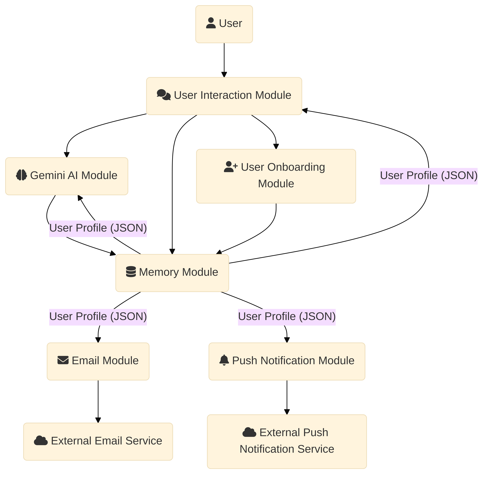

# Architecture Overview

Below is a high-level diagram of the Cognitive Companion Agentic AI system:

<!-- or use ./assets/architecture_v2.png if stored in /assets -->

## Components

### 1. **User Interface**
- CLI-based for now (command line interaction)
- Accepts natural language input from the user

### 2. **Agent Core**
- **Planner**: *(To be implemented)* will break user goals into subtasks
- **Executor**: Calls Gemini API with context and handles tool execution
- **Memory**: JSON-based store to persist user profile, routines, and context

### 3. **Tools / APIs**
- **Gemini API** for LLM responses
- **Gmail SMTP** for notifications
- *(Optional future tools: Push Notification APIs, Calendar, SMS)*

### 4. **Observability**
- Uses terminal logging for:
  - LLM inputs and outputs
  - Memory updates
  - Notification triggers
- Errors are caught and logged
